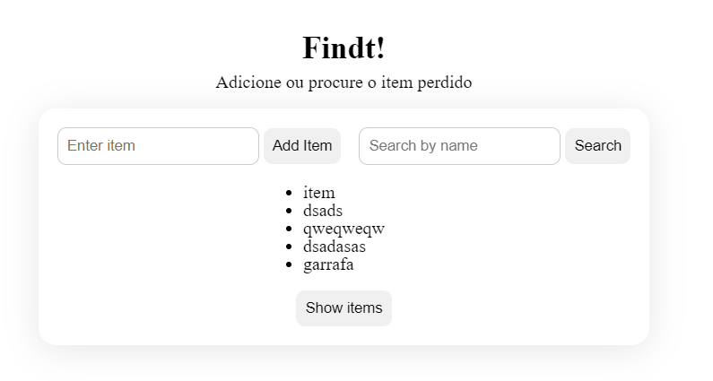

<h1 align="center">Findt!</h1>

Verificando em como o serviços de ‘Achados e Perdidos’ aparece de forma desorganizada
pelas Redes Sociais, foi pensado um modo de colocar toda essa funcionalidade em apenas
um lugar. Com a comodidade em utilizar diretamente dispositivos móveis, foi tencionado
a criação de um projeto para a formação de um aplicativo. Desse modo, já que o mercado
de aplicativos apresenta grande destaque e crescimento, o presente projeto propõe um
aplicativo para encontrar itens perdidos, que centraliza algumas funções já disponíveis
em outras aplicações, buscando dar praticidade ao usuário e total autonomia ao
administrador. O aplicativo Findt! é um projeto de estudantes do curso de Análise e
Desenvolvimento de Sistemas, ofertado pela Universidade Presbiteriana Mackenzie.

-----

Versão: v0.0.2-alpha

Para essa versão foi feito somente as funcionalidades mais básicas em busca de especificidade para o usuário final.

